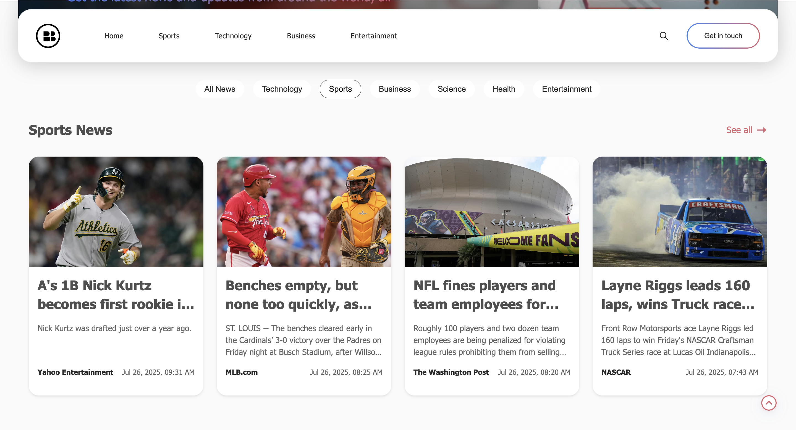

# DailyBuzz: Modern React News Portal

A visually rich, modular news web app built with React and Vite, fetching live news from NewsAPI.org. Explore trending stories, search topics, and browse by category with a beautiful, responsive UI.

<br>

<br>

## Table of Contents
1. [About the Project](#about-the-project)
2. [Tech Stack](#tech-stack)
3. [Getting Started](#getting-started)
4. [Folder Structure](#folder-structure)
5. [Color Palette](#color-palette)
6. [Image Credits](#image-credits)
7. [API Credits](#api-credits)
8. [What I Learned](#what-i-learned)
9. [More Info](#more-info)

[⬆️ Back to Top](#dailybuzz-modern-react-news-portal)

<br>

<br>

## About the Project
DailyBuzz is a personal project that delivers the latest news in a modern, card-based UI. Users can:

## 🖼️ Output Preview

Here are some screenshots of DailyBuzz running with a valid NewsAPI key:

<div align="center">
  
  <br><sub>Homepage: Top headlines and featured sections</sub>
  <br><br>
  
  <br><sub>Category page: News filtered by selected category</sub>
  <br><br>
  
  <br><sub>Search results for a news topic</sub>
  <br><br>
  
  <br><sub>Category filter pills for browsing news by topic on homepage</sub>
  <br><br>
</div>

---
[⬆️ Back to Top](#table-of-contents)

<br>

<br>

## Tech Stack
- **React** (with Hooks)
[⬆️ Back to Top](#table-of-contents)

<br>

<br>

## Getting Started
1. **Clone the repo:**
   ```sh
   git clone https://github.com/ayush-sleeping/DailyBuzz.git
   cd DailyBuzz
   ```
2. **Install dependencies:**
   ```sh
   npm install
   ```
3. **Get your own NewsAPI key:**
   - Sign up for a free developer account at [NewsAPI.org](https://newsapi.org/).
   - After registration, you will receive an API key.
   - Create a `.env` file in the root of the project:
     ```env
     VITE_NEWS_API_KEY=your_api_key_here
     ```
   - **Note:** The `.env` file is git-ignored and never committed. This key is only for local development.
4. **Run the app:**
   ```sh
   npm run dev
   ```
5. **Open in browser:**
   - Visit [http://localhost:5173](http://localhost:5173)

[⬆️ Back to Top](#table-of-contents)

<br>

<br>

## Folder Structure
```
DailyBuzz/
├── public/
│   └── vite.svg
├── src/
│   ├── assets/           # Images, logos, icons
│   ├── components/
│   │   ├── Header/
│   │   ├── Footer/
│   │   ├── News/
│   │   └── homepage/
│   ├── data/             # (Optional) Mock data
│   ├── pages/            # Home, Category, Search, etc.
│   ├── styles/           # Global styles
│   ├── App.jsx
│   ├── main.jsx
│   └── index.css
├── .env                  # API key (not committed)
├── package.json
├── vite.config.js
└── README.md
```
- Components are modular and grouped by feature.
- Pages handle routing and data fetching.
- All API keys are kept in `.env` (never commit this file).

[⬆️ Back to Top](#table-of-contents)

<br>

<br>

## Color Palette
- **Primary:** #d96570 (rose red)
- **Accent:** #f7c873 (golden yellow)
- **Background:** #fff, #f7f7f7
- **Text:** #222, #444
- **Other:** #eaeaea, #f3f3f3

[⬆️ Back to Top](#table-of-contents)

<br>

<br>

## Image Credits
All images and logos used in this project are downloaded from Pinterest. Thanks to the creators and Pinterest for the resources.

[⬆️ Back to Top](#table-of-contents)

<br>

<br>

## API Credits
Thanks to [NewsAPI.org](https://newsapi.org/) for providing a developer subscription with 100 requests per day.


<br>

## ⚠️ API Key Security in Production

**Important:**
- For local development, you can use your NewsAPI key in a `.env` file as described above.
- For public deployments (like GitHub Pages), do NOT expose your NewsAPI key in the frontend code. Anyone can see it in the browser.
- To keep your key secure in production, use a free serverless function (e.g., Netlify Functions or Vercel) as a proxy. Your frontend fetches news from this proxy, which keeps your key secret.

**How to run this project locally:**
1. Get your own NewsAPI key (see above).
2. Create a `.env` file and add your key.
3. Run the app with `npm run dev` and enjoy live news data!

**How to deploy securely:**
- Set up a serverless function (see project docs or ask the maintainer for a sample) to proxy NewsAPI requests.
- Never commit or expose your API key in the frontend code or public repo.

[⬆️ Back to Top](#table-of-contents)

<br>

<br>

## What I Learned
- Building a modular, scalable React project structure
- Integrating real-world APIs and handling async data
- Advanced React Router usage for dynamic pages
- Responsive UI/UX with modern CSS
- Managing API keys securely with .env
- Handling API request limits and error states

[⬆️ Back to Top](#table-of-contents)

<br>

<br>

## More Info
- This is a personal project; contributions are not accepted.
- Explore, learn, and enjoy the news!

[⬆️ Back to Top](#table-of-contents)
